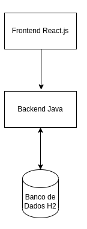
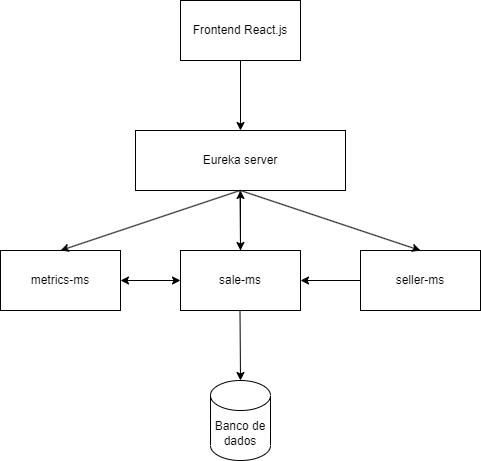
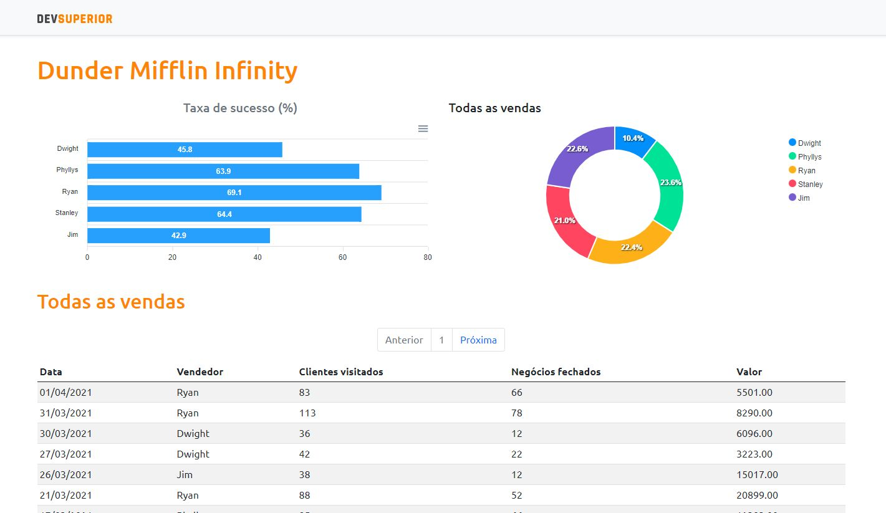

# TCC - Dificuldades e padrões evolutivos na migração de microsserviços
> Nesse TCC, abordei toda a parte teórica de uma migração de um sistema de arquitetura monolítica para uma de microsserviços. Desde seus padrões mais conhecidos, dificuldades e casualidades.
> 
> Além disso, fiz uma prova de conceito pegando o meu projeto Dunder Mifflin Infinity, antes em arquitetura monolítica, e migrando ele para microsserviços. :-)
## Design do app monolítico:

## Design do app migrado para microsserviços:

## Diagrama de sequência:

### Dashboard principal (SPA ReactJS):

